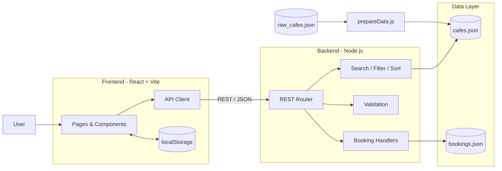

<div align="center">

# ☕ Jaipur Hope

### A Full-Stack Café Discovery & Table Reservation Platform for Jaipur

<p>
  <strong>Discover • Filter • Save • Book</strong>
</p>

<p>
  A full-stack web application that helps users discover cafés across Jaipur, explore detailed information, apply advanced filters, save favourites, and make table reservations through a unified interface.
</p>

<p>
  
  
  
  
  
  
  
</p>

</div>

---

## 📌 Overview

**Jaipur Hope** is a full-stack café discovery and table-booking platform designed around the experience of finding and reserving cafés in Jaipur.

The application combines a searchable café catalogue, multi-parameter filtering, café detail pages, saved cafés, and an end-to-end reservation workflow.

The project demonstrates practical full-stack development concepts including:

* REST API design
* React component architecture
* Server-side search and filtering
* Data normalization and ETL
* Form validation
* Client-side persistence
* Pagination
* File-based data persistence
* Responsive UI development
* API integration

### 🎯 Problem

Café discovery and table reservations are often fragmented across search engines, maps, social media and phone calls.

### 💡 Solution

Jaipur Hope provides a single platform where users can:

**Search → Filter → Explore → Save → Book**

### 📊 Project Scale

| Metric   | Details                   |
| -------- | ------------------------- |
| Cafés    | **282 curated cafés**     |
| Areas    | **19 Jaipur areas**       |
| Themes   | **18 themes**             |
| Cuisines | **14 cuisine categories** |
| Frontend | React 18 + Vite           |
| Backend  | Node.js REST API          |
| Data     | JSON-based datastore      |

---

# ✨ Key Features

## 🔍 Café Discovery

* Full-text café search
* Search by café name, area, cuisine, theme and keywords
* Multi-parameter filtering
* Filter by:

  * Area
  * Theme
  * Cuisine
  * Best-for category
  * Minimum rating
* Amenity-based filtering:

  * 🐾 Pet friendly
  * 💑 Couple friendly
  * 👨‍👩‍👧 Family friendly
  * 🌇 Rooftop seating
  * 🌳 Outdoor seating
  * 🌱 Vegan options
* Multiple sorting options
* Server-side pagination

### Sorting Options

* Featured
* Rating
* Aesthetic score
* Review count
* Name

---

## 📅 Table Reservation

The application provides an end-to-end booking workflow:

**Café → Booking Form → Validation → Confirmation**

Features include:

* Reservation form
* Server-side input validation
* Date validation
* Guest count validation
* Unique booking IDs
* Booking confirmation
* Reservation lookup using phone number
* Booking cancellation
* Soft-delete booking mechanism

Example booking ID:

```text
BK-3F9A21C7
```

Guest capacity supported by the current API:

```text
1–30 guests
```

---

## ❤️ Saved Cafés

Users can save cafés for later.

Saved cafés are persisted using:

```text
localStorage
```

A custom React hook provides the persistence layer:

```text
useLocalStorage
useSavedCafes
```

The implementation also includes graceful fallback behavior when browser storage is unavailable.

---

## 🎨 Responsive Frontend

The frontend follows a responsive, mobile-first design approach.

### Mobile

* Bottom navigation
* Responsive café cards
* Filter sheet
* Touch-friendly interface

### Desktop

* Sidebar navigation
* Expanded filtering experience
* Responsive multi-column layouts

The UI uses a custom CSS design system rather than relying on a third-party component library.

The visual identity is inspired by Jaipur through:

* Sandstone-inspired visual language
* Blue-pottery inspired accents
* Jali lattice motifs
* Jharokha-inspired image styling

---

# 🛠️ Technology Stack

| Layer                   | Technology                    |
| ----------------------- | ----------------------------- |
| **Frontend**            | React 18                      |
| **Routing**             | React Router v6               |
| **Build Tool**          | Vite 5                        |
| **Styling**             | Custom CSS                    |
| **State / Persistence** | React Hooks + localStorage    |
| **API Client**          | Fetch API                     |
| **Backend**             | Node.js 18+                   |
| **HTTP Server**         | Native Node.js `http`         |
| **Data Processing**     | Node.js ETL script            |
| **Data Store**          | JSON                          |
| **API Architecture**    | RESTful JSON API              |
| **Development**         | npm, Vite HMR, `node --watch` |

### Backend Dependencies

The backend intentionally uses **Node.js built-in modules** such as:

```text
http
fs
crypto
```

This keeps the backend lightweight and demonstrates implementation using Node.js core APIs.

---

# 🏗️ System Architecture



---

# 📂 Project Structure

```text
jaipur-hope/
│
├── backend/
│   ├── server.js
│   │   └── HTTP server, routing and API handlers
│   │
│   ├── scripts/
│   │   └── prepareData.js
│   │       └── ETL pipeline for dataset preparation
│   │
│   └── data/
│       ├── raw_cafes.json
│       ├── cafes.json
│       └── bookings.json
│
├── frontend/
│   ├── index.html
│   ├── vite.config.js
│   │
│   └── src/
│       ├── App.jsx
│       ├── api.js
│       ├── hooks.js
│       │
│       ├── components/
│       │   ├── CafeCard
│       │   ├── FilterSheet
│       │   ├── Layout
│       │   ├── JaliMotif
│       │   ├── Icons
│       │   └── Shared
│       │
│       └── pages/
│           ├── Home
│           ├── CafeDetail
│           ├── BookingPage
│           ├── BookingConfirmation
│           ├── MyBookings
│           ├── SavedCafes
│           └── NotFound
│
└── README.md
```

---

# 🚀 Getting Started

## Prerequisites

Make sure you have:

* **Node.js 18 or higher**
* **npm**

Check your installation:

```bash
node --version
npm --version
```

---

## 1. Clone the Repository

```bash
git clone https://github.com/Adityaa097/jaipur-hope.git
cd jaipur-hope
```

---

## 2. Start the Backend

Open a terminal:

```bash
cd backend
node server.js
```

The API will start at:

```text
http://localhost:3001
```

You should see:

```text
Jaipur Hope API running on http://localhost:3001
Loaded 282 cafes
```

---

## 3. Start the Frontend

Open a second terminal:

```bash
cd jaipur-hope/frontend
npm install
npm run dev
```

The frontend will be available at:

```text
http://localhost:5173
```

---

# ⚙️ Configuration

| Variable       | Location        | Default                 | Description     |
| -------------- | --------------- | ----------------------- | --------------- |
| `PORT`         | Backend         | `3001`                  | API server port |
| `VITE_API_URL` | `frontend/.env` | `http://localhost:3001` | Backend API URL |

### Custom Backend Port

```bash
PORT=4000 node server.js
```

Then configure the frontend:

```bash
echo "VITE_API_URL=http://localhost:4000" > frontend/.env
```

---

# 📜 Available Scripts

| Directory   | Command                | Purpose                         |
| ----------- | ---------------------- | ------------------------------- |
| `backend/`  | `npm start`            | Start backend                   |
| `backend/`  | `npm run dev`          | Start backend with auto-reload  |
| `backend/`  | `npm run prepare-data` | Regenerate cleaned café dataset |
| `frontend/` | `npm run dev`          | Start Vite development server   |
| `frontend/` | `npm run build`        | Create production build         |
| `frontend/` | `npm run preview`      | Preview production build        |

---

# 📡 REST API

### Base URL

```text
http://localhost:3001
```

## Endpoints

| Method   | Endpoint               | Purpose                                 |
| -------- | ---------------------- | --------------------------------------- |
| `GET`    | `/api/health`          | API health check                        |
| `GET`    | `/api/cafes`           | Search, filter, sort and paginate cafés |
| `GET`    | `/api/cafes/:id`       | Retrieve café details                   |
| `GET`    | `/api/filters`         | Retrieve available filter values        |
| `GET`    | `/api/bookings?phone=` | Retrieve bookings                       |
| `POST`   | `/api/bookings`        | Create reservation                      |
| `DELETE` | `/api/bookings/:id`    | Cancel reservation                      |

---

# 🔎 Café Search API

### Query Parameters

| Parameter        | Type    | Example               |
| ---------------- | ------- | --------------------- |
| `search`         | string  | `search=rooftop`      |
| `area`           | string  | `area=Bani Park`      |
| `theme`          | string  | `theme=rooftop`       |
| `cuisine`        | string  | `cuisine=Italian`     |
| `bestFor`        | string  | `bestFor=Couples`     |
| `minRating`      | number  | `minRating=4.2`       |
| `petFriendly`    | boolean | `petFriendly=true`    |
| `coupleFriendly` | boolean | `coupleFriendly=true` |
| `familyFriendly` | boolean | `familyFriendly=true` |
| `rooftopSeating` | boolean | `rooftopSeating=true` |
| `outdoorSeating` | boolean | `outdoorSeating=true` |
| `veganOptions`   | boolean | `veganOptions=true`   |
| `sortBy`         | string  | `sortBy=rating`       |
| `page`           | integer | `page=2`              |
| `limit`          | integer | `limit=20`            |

### Example Request

```bash
curl "http://localhost:3001/api/cafes?rooftopSeating=true&minRating=4&sortBy=rating&limit=5"
```

### Example Response

```json
{
  "total": 42,
  "page": 1,
  "limit": 5,
  "totalPages": 9,
  "cafes": []
}
```

---

# 📅 Booking API

## Create a Reservation

```http
POST /api/bookings
```

### Request

```json
{
  "cafeId": "<cafe-id>",
  "name": "Riya Sharma",
  "phone": "9876543210",
  "date": "2026-10-12",
  "time": "19:30",
  "guests": 4,
  "specialRequest": "Window seat, please"
}
```

### Successful Response

```json
{
  "id": "BK-3F9A21C7",
  "status": "confirmed",
  "cafeName": "...",
  "createdAt": "2026-09-29T10:15:00.000Z"
}
```

### Validation

The API validates:

* Required fields
* Café ID
* Date format
* Guest count
* Booking data
* Invalid café references

Possible responses include:

```text
400 Bad Request
404 Not Found
201 Created
```

---

# 🔄 Data Pipeline

The project includes an ETL pipeline implemented in:

```text
backend/scripts/prepareData.js
```

The pipeline converts the raw café dataset into an API-ready normalized format.

### Processing Steps

```text
Raw Dataset
     ↓
Data Cleaning
     ↓
Normalization
     ↓
Boolean Conversion
     ↓
Schema Transformation
     ↓
cafes.json
     ↓
REST API
     ↓
React Frontend
```

### Data Processing Includes

* Normalizing inconsistent area names
* Removing formatting inconsistencies
* Converting `"Yes"` / `"No"` values into booleans
* Generating a consistent café schema
* Preparing searchable keywords
* Structuring image information
* Preparing ratings and review information
* Preparing amenity flags

### Regenerate Dataset

```bash
cd backend
npm run prepare-data
```

---

# 🧠 Engineering Decisions

| Decision                    | Reason                                                                    |
| --------------------------- | ------------------------------------------------------------------------- |
| **Zero-dependency backend** | Keeps the backend lightweight and demonstrates Node.js core API knowledge |
| **In-memory Map index**     | Provides efficient café ID lookups                                        |
| **Server-side filtering**   | Reduces unnecessary client-side processing                                |
| **Server-side pagination**  | Keeps API responses manageable                                            |
| **Soft-delete bookings**    | Preserves booking history                                                 |
| **Unique booking IDs**      | Provides readable reservation identifiers                                 |
| **Request body limit**      | Adds basic protection against oversized requests                          |
| **Custom React hooks**      | Keeps frontend state management lightweight                               |
| **ETL preprocessing**       | Separates raw data from application-ready data                            |

---

# 🔐 Validation & Reliability

The backend implements several basic reliability mechanisms:

* Request validation
* Required-field validation
* Guest-count validation
* Date validation
* Café existence validation
* Booking existence validation
* Request body size limitation
* Soft-delete booking cancellation
* Phone-number normalization
* Graceful local-storage fallback

---

# 📱 User Flow

```text
                    ┌──────────────┐
                    │     Home     │
                    └──────┬───────┘
                           ↓
                  ┌─────────────────┐
                  │ Search / Filter │
                  └────────┬────────┘
                           ↓
                  ┌─────────────────┐
                  │  Café Details   │
                  └───────┬─────────┘
                          ↓
              ┌───────────┴───────────┐
              ↓                       ↓
       Save Café                 Book Table
              ↓                       ↓
      Saved Cafés              Booking Form
                                      ↓
                                Confirmation
                                      ↓
                                My Bookings
```

---

# 📈 Future Improvements

The current implementation is designed as a portfolio/demo application. The following improvements would be appropriate for production deployment:

* [ ] PostgreSQL or MongoDB migration
* [ ] User authentication and authorization
* [ ] JWT-based authentication
* [ ] Role-based access control
* [ ] Strict CORS configuration
* [ ] Input sanitization
* [ ] API rate limiting
* [ ] Real-time table availability
* [ ] Double-booking prevention
* [ ] Unit and integration testing
* [ ] GitHub Actions CI/CD
* [ ] Docker containerization
* [ ] Cloud deployment
* [ ] Interactive café map
* [ ] Google Maps integration
* [ ] Production monitoring and logging

---

# ⚠️ Current Limitations

The current project uses JSON files for persistence.

This makes the project easy to run locally but is not ideal for high-concurrency production workloads.

For a production deployment, the persistence layer should be migrated to a database such as:

```text
PostgreSQL
MongoDB
```

Authentication, rate limiting, stricter CORS policies, automated testing and real-time availability would also be required for a production-grade booking platform.

---

# 🩺 Troubleshooting

### Backend Port Already in Use

If port `3001` is already occupied:

```bash
PORT=4000 node server.js
```

Then update:

```text
frontend/.env
```

```env
VITE_API_URL=http://localhost:4000
```

---

### Frontend Shows No Cafés

Make sure the backend is running:

```bash
cd backend
node server.js
```

Then verify:

```text
http://localhost:3001/api/health
```

---

### Node.js Not Found

Install Node.js 18+ and verify:

```bash
node --version
```

---

### Images Load Slowly

Café images are loaded from external sources, so loading performance can depend on network conditions and the availability of those image sources.

---

# 💼 What This Project Demonstrates

This project showcases practical software engineering skills across the full stack:

### Frontend

* React component architecture
* React Router
* Custom hooks
* Responsive design
* API integration
* Client-side persistence
* Form handling

### Backend

* Node.js HTTP server
* REST API development
* Request routing
* Input validation
* Pagination
* Search and filtering
* Data persistence
* Error handling

### Data Engineering

* Dataset cleaning
* ETL pipeline
* Data normalization
* Schema transformation
* Search-ready data preparation

### Software Engineering

* Modular project structure
* API-driven architecture
* Separation of frontend and backend
* Reusable components
* Configuration management
* Production improvement roadmap

---

# 👨‍💻 Author

**Aditya**

GitHub: [@Adityaa097](https://github.com/Adityaa097)

Repository: [Jaipur Hope](https://github.com/Adityaa097/jaipur-hope)

---

<div align="center">

### ⭐ If you found this project useful, consider giving it a star!

Built with React + Node.js

</div>
